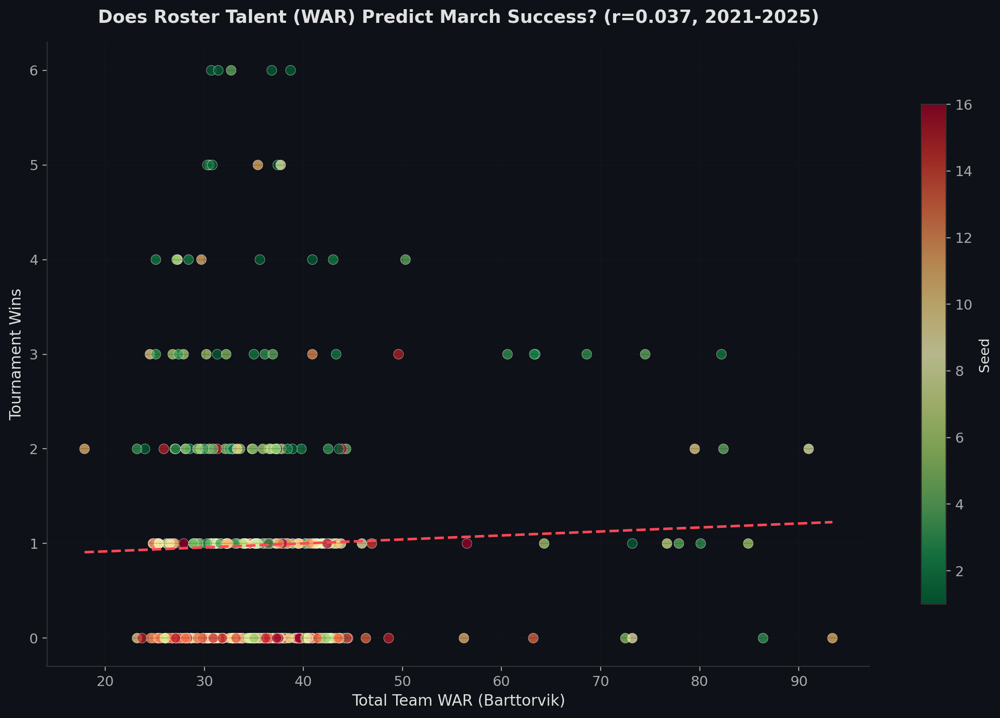
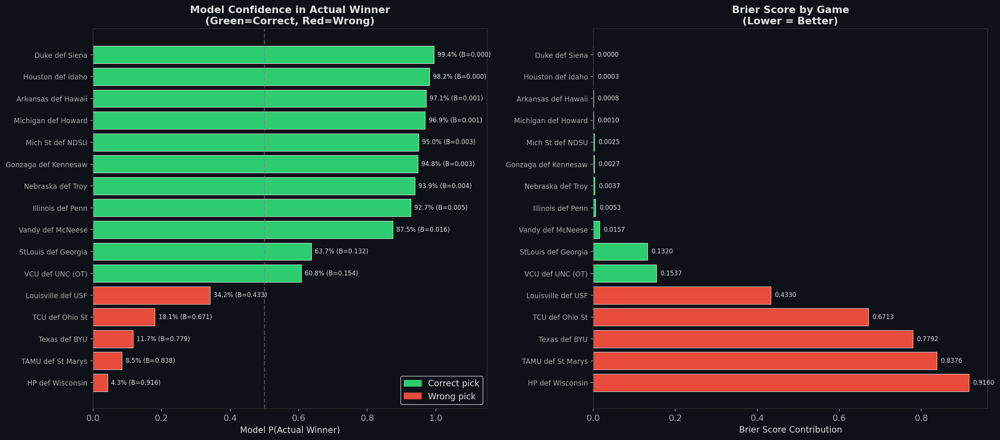
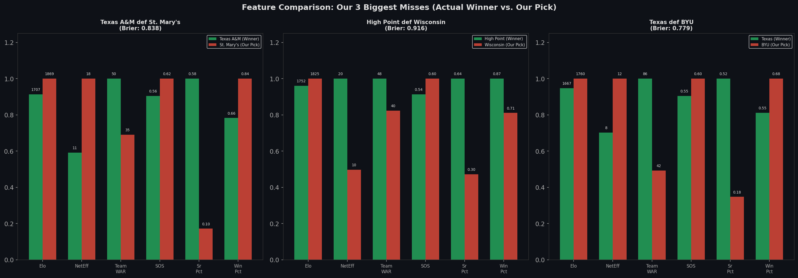

# We Added 30,000 Player Records to Our March Madness Model. It Got Worse.

Every March, millions of people fill out brackets using some combination of gut feel, school loyalty, and whatever ESPN told them to think. Our team at South Shore had a group bracket going this year, and when it came time to fill mine out, I had an idea. I'd entered Kaggle's $50K March Machine Learning Mania competition before - predict the probability of every possible tournament matchup, get scored on calibration, compete against thousands of data scientists worldwide - and last time it took me two to three weeks to build the full pipeline. What if I could do it in a matter of hours?

I wanted to test whether I could compress the entire process - building the pipeline, picking the features, training the models, generating the bracket - using Claude Code as my copilot. And honestly, I felt really good about it. Each phase of the build came together cleanly, and the model's cross-validation numbers were competitive. Then the tournament started, and the very first game I predicted went wrong. That's where things got interesting, because I wanted to understand *why* we missed it, and whether there was data out there that could have told us otherwise.

I downloaded 30,000 individual player records. Engineered eight new features from them. Reran every model configuration I had.

The model got worse. Across every single one.

*A quick note on methodology: the competition evaluates predictions on Brier score, which punishes overconfidence quadratically. Predict 95% and get it wrong, and you pay roughly 3x the penalty of predicting 55% and getting it wrong. Everything below reflects real predictions we submitted before tipoff, scored against real tournament results.*

---

## Part 1: The Pipeline

A project like this - ingesting historical game data, engineering features, training and comparing models, generating calibrated probability estimates for 132,000 matchups - normally takes a couple of weeks. This time I used Claude Code to accelerate the build, which let me compress the core pipeline into a single working session and spend a second session on the player data experiment and post-mortem analysis.

But the interesting part isn't the speed. It's the decisions I made along the way and what I learned from the ones I got wrong.

The pipeline itself is fairly standard for this type of competition: I ingested 101 data files across four sources (Kaggle historical data, KenPom-equivalent efficiency metrics from Barttorvik, coaching records, and player-level stats), engineered 57 features per team-season covering efficiency metrics, Elo ratings, strength of schedule, and coaching experience, then trained five model architectures against each other. Logistic regression, a pure Elo-based Bradley-Terry model, XGBoost, LightGBM, and a neural network.

LightGBM won, and it wasn't close. A cross-validated Brier score of 0.050 versus 0.054 for XGBoost and 0.115 for the neural net. Tree-based models dominate this kind of small, tabular prediction problem, and the literature backs that up pretty consistently. The realistic ceiling for this competition sits around 0.04 to 0.06, so I was in the neighborhood. Good enough to feel confident.

[INSERT VISUAL: Pipeline Overview - visual-1-pipeline-overview.png]

---

## Part 2: The Player Data Experiment

That confidence lasted about four hours. The model gave Ohio State an 82% chance of beating TCU, and TCU won on a layup with 4.3 seconds left. I started digging into *why*, and one of the first things I noticed was that several teams in the tournament field had key players out with injuries that my model knew nothing about. It got me thinking: individual players win basketball games. If I could capture who's actually on each roster - their **WAR** (Wins Above Replacement, a cumulative value metric from Barttorvik), their experience level, how dependent the team is on one star - maybe that's the signal the team-level aggregates were missing.

I pulled 30,000 player records spanning six seasons and engineered eight team-level features from them: total roster WAR, best player's WAR, star usage rate, experience mix (average class year and senior percentage), roster height, and a WAR concentration metric measuring star dependency. I matched 99.3% of players to Kaggle team IDs and reran 30 model configurations across XGBoost, LightGBM, and the neural network.

The Brier score went from 0.0503 to 0.0544. Not one configuration improved. Every player feature had a correlation with tournament outcomes below r = 0.12, and not one cracked the top 15 in feature importance. I plotted total roster WAR against tournament wins across five years of data and got … a cloud. Correlation of r = 0.037. Nothing.

[INSERT VISUAL: Session 2 Flowchart - visual-1b-session2-flowchart.png]

The reason sounds obvious in retrospect but genuinely wasn't when I started: team efficiency metrics already capture what individual players contribute. When your best player drops 25 on good efficiency, that shows up in offensive rating, eFG%, and adjusted offensive efficiency. The player stat is redundant with the team stat, except noisier. And college basketball statistics are *spectacularly* noisy - [research has shown](https://pubmed.ncbi.nlm.nih.gov/31046653/) you need approximately 100 games for basketball statistics to stabilize to reliable estimates. A college season is 30 to 35 games. The noise floor is enormous, and I was adding noise to a model that was already reading the signal through a cleaner lens.

Here's the kicker: across a decade of Kaggle March Madness competitions, no publicly documented winning solution has used player-level data. The most prolific tool in the competition's history isn't a model at all - it's an [open-source function](https://github.com/gotoConversion/goto_conversion) that corrects a well-known statistical bias using a handful of lines of math. No machine learning, no training data, no feature engineering. It has powered $47,000 in prize money, 10+ gold medals, and 100+ medals on Kaggle. Sometimes the most sophisticated answer to "should we add more data?" is just … no. Before you add another data source to your pipeline, ask whether the signal is already in what you have. More columns isn't always more insight.

---

## Part 3: The Scorecard

Then the tournament started, and I got to see how the model performed against actual basketball.

Through two rounds: **36 of 48 correct (75%)**. The model nailed every heavy chalk pick, called VCU's upset over North Carolina at 60.8% confidence (VCU completed the largest first-round comeback in tournament history, rallying from 19 down to win in overtime behind Terrence Hill Jr.'s career-high 34), and correctly picked St. Louis over Georgia at 63.7% (St. Louis won by 25). Those felt very good.

And then there were the misses that wrecked everything.

| **Game** | **Our Prediction** | **What Actually Happened** | **Brier** |
|------|---------------|----------------------|-------|
| (9) Iowa 73, (1) Florida 72 | Florida wins, 97.1% | Folgueiras' go-ahead 3, 4.5 sec left; first 1-seed to fall | 0.943 |
| (11) Texas 74, (3) Gonzaga 68 | Gonzaga wins, 96.1% | First Four team reaches the Sweet 16 | 0.923 |
| (12) High Point 83, (5) Wisconsin 82 | Wisconsin wins, 95.7% | Chase Johnston's fastbreak layup, 11.2 sec left | 0.916 |
| (10) Texas A&M 63, (7) St. Mary's 50 | St. Mary's wins, 91.5% | A&M led wire-to-wire, held StM to season-low 50 | 0.838 |
| (4) Nebraska 74, (5) Vanderbilt 72 | Vanderbilt wins, 89.1% | Frager's layup, 2.2 sec left; Nebraska reaches first Sweet 16 | 0.795 |

Five games, all predicted at 89% or higher for the wrong team. Together they accounted for 47% of our total prediction error across 48 games. The single worst miss: giving No. 1 seed Florida a 97.1% chance, only to watch Iowa end their season. That's the thing about Brier score - being confidently wrong is *catastrophic* - and I was precisely that, repeatedly.

*Round of 64, Thursday (16 games). Full two-round record: 36 of 48 (75%).*

---

## Part 4: Why We Missed (and the Irony)

The fascinating thing about our biggest misses is that they weren't random. They shared a clear pattern, and the more games we played, the harder it became to unsee.

In the first round, the winning team had more experienced rosters in every major miss: 64%, 58%, and 52% seniors compared to 30%, 10%, and 18% for the teams I picked. All three winners had higher total roster WAR. High Point actually had *better* net efficiency than Wisconsin (20.2 vs 10.0) and a higher win percentage (87% vs 71%). Texas brought a coaching staff with 22 tournament wins to the floor against BYU's two.

The pattern only intensified in the Round of 32. Texas, the team we gave a 3.9% chance against Gonzaga, beat the Bulldogs by 6 to reach the Sweet 16 as a First Four team. We were wrong about Texas in all three of their games, each time more confidently wrong (68.9%, then 88.3%, then 96.1%), and each time their Team WAR (85.5, among the highest in the entire tournament field) was the signal we should have listened to. Gonzaga's own coach said it postgame: "[Texas] is not a Cinderella team. That's a really talented basketball team with a really, really, really good coach." It also helped that Gonzaga was missing **Braden Huff**, their leading scorer (17.8 points per game), to a dislocated kneecap since January. Our model had no idea.

But the model kept making the same mistake. It saw Wisconsin's 5-seed and 1825 Elo. It saw St. Mary's 1869 Elo, inflated by a lighter West Coast Conference schedule. It saw Florida's 1978 Elo and 1-seed. And it treated those signals as near-certainties.

| **What the Model Weighted Heavily** | **What It Underweighted** |
|----|-----|
| Wisconsin: 5-seed, 1825 Elo, 0.93 BARTHAG | High Point: 20.2 net efficiency (vs 10.0), 64% seniors |
| St. Mary's: 27-6, 1869 Elo | Texas A&M: 58% seniors, Team WAR 50 vs 35, SEC schedule |
| Florida: 1-seed, 1978 Elo, 0.97 BARTHAG | Iowa: Team WAR 38 vs 30; even Vegas only had Florida at ~85% |
| Gonzaga: 3-seed, 1933 Elo | Texas: Team WAR 86 vs 39, plus Gonzaga missing Huff (17.8 PPG) |
| BYU: 6-seed, 1760 Elo | Texas: Team WAR 86 vs 42, coach with 22 tourney wins |

Which brings us to the irony at the heart of this whole project. The player-derived features that made my aggregate model worse (Team WAR, senior percentage, experience metrics) are exactly the features that would have flagged many of these upsets. They don't improve predictions across 1,400 historical tournament games because the signal is already captured in team efficiency stats. But in the handful of games per year where the model is most dangerously overconfident, they're precisely what's missing. The aggregate model doesn't need them. The edge cases desperately do.

*Our three biggest first-round misses. In every one, Elo favored our pick. But WAR, experience, and efficiency favored the actual winner.*

---

## Part 5: Where Player Data Actually Matters

One more thing that stuck with me, and it's the finding that translates most cleanly outside of basketball.

Seven players across the 2026 tournament field were injured or ruled out before the bracket was even set. Every single announcement was public - reported by beat writers and team accounts anywhere from 12 to 64 days before tipoff. Our model knew none of it.

When we adjusted Duke's 99.4% prediction for two injured players representing 26% of their roster's WAR, it dropped to 86.6% - and Duke ended up winning by just 6 after trailing by 13.

And it wasn't just Duke. Gonzaga was missing Braden Huff (17.8 PPG, dislocated kneecap since January) when we gave them a 96.1% chance against Texas. BYU was missing Richie Saunders (18.0 PPG, torn ACL) when we gave them 88.3% against the same Texas team, turning them into a one-man AJ Dybantsa show where the bench scored zero points. In both cases, the injury information was public weeks before tipoff, and in both cases, the team we favored lost.

This is the one context where player data genuinely matters: not as a model feature you train on, but as a real-time correction when team-level stats go stale. When a key player goes down, the team's season-long averages become a lagging indicator, and you need individual-level data to re-estimate what the remaining roster can actually produce.

How many of us have been in a version of this situation? You're reporting last quarter's metrics as though they still reflect today's reality, and the one thing that changed - a key hire who left, a product line that got cut, a market that shifted - isn't in the dashboard yet. Stale data isn't just an analytics inconvenience. It's a blind spot, and it has a habit of showing up right when the stakes are highest.

---

## The Takeaway

I compressed a multi-week ML project into a couple of working sessions, trained five model architectures, tested a 30,000-record player data hypothesis, and submitted predictions for 132,000 tournament matchups. The model went 36 for 48 through two rounds, nailed four upset picks, and also gave Florida a 97% chance of beating a 9-seed that won on a three-pointer with 4.5 seconds left. It gave Wisconsin a 96% chance of beating a 12-seed that outperformed them in nearly every metric that mattered, and the game-winning basket came from Chase Johnston, a bench player who had not made a single two-point field goal all season. His first one ended Wisconsin's season with 11 seconds left.

You can build better models faster than ever. But faster pipelines don't fix blind spots in your features, and more data doesn't help when the signal is already in what you have. The interesting work isn't building the model. It's knowing which predictions to trust and which ones to interrogate.

Thanks for reading! If your team is sitting on data and not sure what to do with it … that's what we do. Let's connect!

#MarchMadness #DataScience #MachineLearning #Analytics
